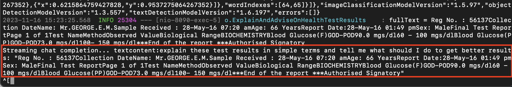

# Use Cohere, Oracle Database, and OCI Vision Text Detection to Interpret Health Test Results

## Introduction

In this lab, you will use a combination of Cohere, the Oracle Database, and OCI Vision Text Detection for a medical use case. This use case helps everyday people better understand health test results by using the power of Cohere and generative AI to provided deeper understanding and context to their results. This begins with uploading a photo of health test results. From there the image is sent to the OCI Vision service, where the text is extracted from the image. The text is then included in a request to Cohere, where we ask Cohere to provided a deeper understanding of the results. The answer generated from Cohere is then displayed back to the user to read.

Estimated Workshop Time: 10 minutes

### Objectives

In this workshop, you will learn how to:
* Use Cohere alongside the Oracle Database and OCI Vision Text Detection to interpret health test results

### Prerequisites

In order to do this workshop, you need

* To have completed the setup lab

## Task 1: Interpret health test results

1. To begin interpreting health test results, first ensure that your SpringBoot application is up and running. If not, navigate to the application directory and run the following command

    ```
    <copy>./build_and_run.sh</copy>
    ```

2. From the application, choose the **App** button under **Lab 3 Provide a picture of a health report**

  

3. You are now able to choose an image to begin interpreting a health test. This lab includes an example file that you can use for this called **bloodsugarreport.jpeg** under the **testfiles** directory. If you have another image of health test results you would like to use, you may also do so.

  

4. Once you have chosen your image, click **Send Request to Vision AI**. Look at the terminal where the SpringBoot application is running to see what happens when you do so. We see that our image is sent to OCI Vision and the text detection results are returned. These results are very long as they include text that is detected, as well as information about where in the image each piece of text was detected.

  

  Below this large block of text, we can see the plain text that was extracted from the image, parsed from these results.

  

  Further below that, we can see the query that is sent to Cohere using this text. Given the text extracted from the image, we prompt Cohere to "explain these test results in simple terms and tell me what should I do to get better results:"

  

5. After looking at the terminal for our SpringBoot application to understand what is happening, we can look again at the app to see the results Cohere gave us advising on the test results. These results are helpful, as they tell us any aspects of the test results that are out of the ordinary and advise on how to improve in those areas.

  


You may now **proceed to the next lab.**

## Learn More

* [Oracle and Partnership](https://cohere.com/deployment-options/oracle)

## Acknowledgements
* **Author**
  * Paul Parkinson, Architect, Developer Evangelist/Advocate
  * Miles Novotny, Cloud Engineer
* **Last Updated By/Date** - Miles Novotny, November 2023
