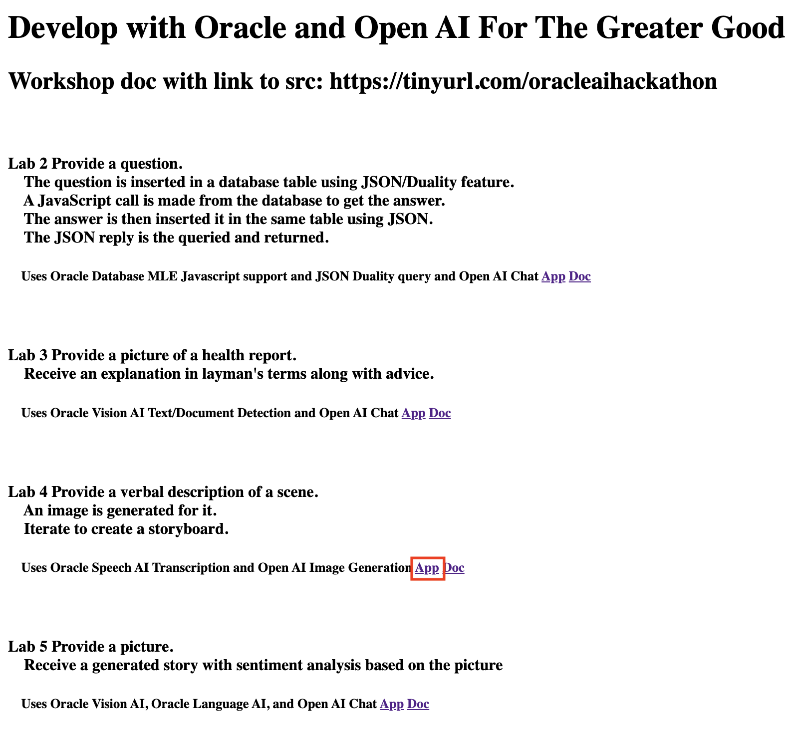
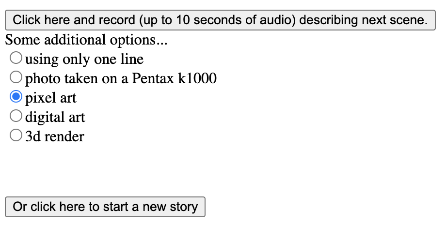
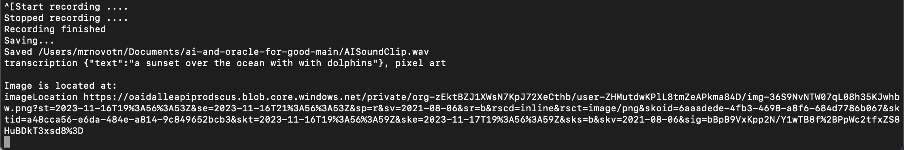
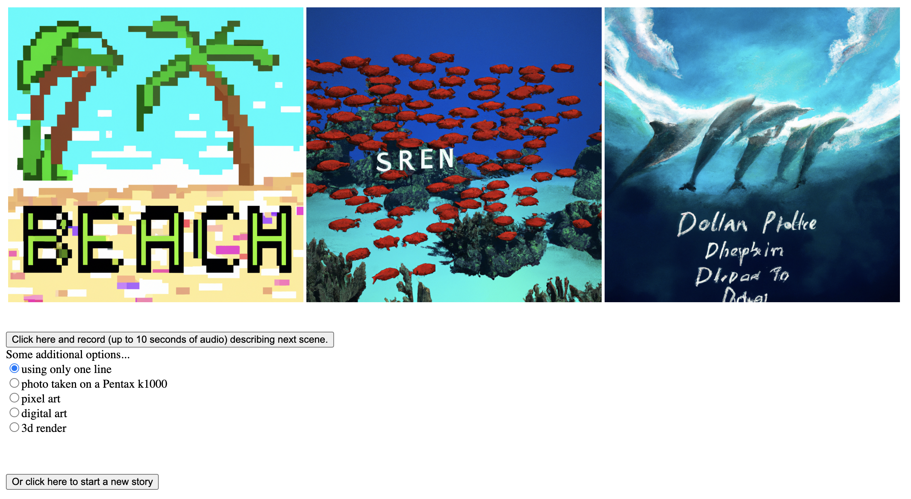

# Use Oracle Database, OCI Speech Service, and Image Generation to Create a Storyboard

## Introduction

In this lab, you will use the Oracle Database, OCI Speech Service, and image generation through OpenAI to create a storyboard with your voice. This use case is relevant to individuals with impaired motor control who might have difficulty using a keyboard. This use case allows them to generate a set of images and create a storyboard with only their voice. This use case begins by creating a short recording describing the image you would like to generate. This recording is sent to OCI Speech, where it is transcribed into text. This transcription is then included in a a request to OpenAI for image generation, the results of which are then displayed in the application.

Estimated Workshop Time: 10 minutes

### Objectives

In this workshop, you will learn how to:
* Use the Oracle Database, OCI Speech Service, and image generation to create a storyboard

### Prerequisites

In order to do this workshop, you need

* To have completed the setup lab

## Task 1: Create Storyboard with Your Voice

1. To begin, ensure that your SpringBoot application is up and running. If not, navigate to the application directory and run the following command

    ```
    <copy>./build_and_run.sh</copy>
    ```

2. From the application, choose the **App** button under **Lab 4 Provide a verbal description of a scene**

  

3. From this page, you can now begin generating images from speech for your storyboard creation. Simply press the record button and begin speaking. You can speak for up to 10 seconds, after which no further input is needed, and an image will be generated. You can choose one of the options under **Some additional options...** to customize the image results returned.

  

4. We can look at the terminal running our SpringBoot application to understand what happens when we generate an image. We first see that the audio is recorded, and stored to a file stored in the application directory. This file is then sent to the OCI Speech service, which returns a text transcript of the audio. This text is then included as part of a prompt sent to OpenAI for the image generation. The response is a url where the generated image is located, which our application can use to display the image on the screen.

  

5. You may generate as many images as you like, until you are satisfied with your storyboard. To clear the results and start a new storyboard, click the button to start a new story.

  


You may now **proceed to the next lab.**

## Learn More

* [Oracle and Partnership](https://cohere.com/deployment-options/oracle)

## Acknowledgements
* **Author**
  * Paul Parkinson, Architect, Developer Evangelist/Advocate
  * Miles Novotny, Cloud Engineer
* **Last Updated By/Date** - Miles Novotny, November 2023
