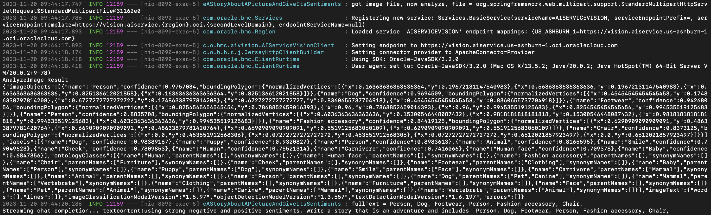

# Detect Objects and Write a Story about them using Oracle Database, OCI Vision, and Cohere

## Introduction

In this lab, will use the Oracle Database, OCI Vision, and Cohere to detect objects in images and write stories about them.

Estimated Workshop Time: 10 minutes

### Objectives

In this workshop, you will learn how to:
* Use the Oracle Database, OCI Vision, and Cohere to write stories about objects in images

### Prerequisites

In order to do this workshop, you need

* To have completed the setup lab

## Task 1: Interpret health test results

1. To begin, ensure that your SpringBoot application is up and running. If not, navigate to the application directory and run the following command

    ```
    <copy>./build_and_run.sh</copy>
    ```

2. From the application, choose the **App** button under **Lab 5 Provide a picture**

  


3. From this page, you can upload an image with which to create a story. Hit the **Choose File** button to select your file, and pick which genre of story you would like to create. Then press **Send Request to Vision AI**

  

4. Look at the terminal running the SpringBoot application to see what happens when we send our request. We see that the image is first sent to OCI Vision for object detection. OCI Vision identifies the objects in the image, and returns the results to the application, where they are displayed in the terminal. This list of detected objects is then included in a prompt sent to cohere, which can be seen at the bottom of the image. The prompt uses these objects, as well as the specified type of story.

  

  In addition to creating a story using the objects in the image, sentiment analysis is also done on the generated story. This is done by including the story in a request to the OCI Language service. OCI Language identifies any people or objects mentioned in the story that have either a positive or negative sentiment associated with them. We can see the generated story in the terminal as it is included in the request to OCI Language, as well as the response detailing the sentiments found in the story.

  

5. Looking back at the application, we can see that the webpage now displays the story created with the objects identified in the image, with the specified genre. In addition, any sentiment identified in the story is also listed.

  


You may now **proceed to the next lab.**

## Learn More

* [Oracle and Partnership](https://cohere.com/deployment-options/oracle)

## Acknowledgements
* **Author**
  * Paul Parkinson, Architect, Developer Evangelist/Advocate
  * Miles Novotny, Cloud Engineer
* **Last Updated By/Date** - Miles Novotny, November 2023
